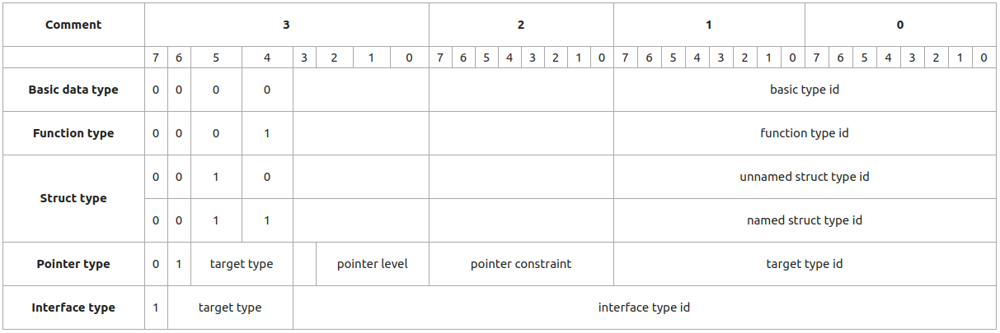
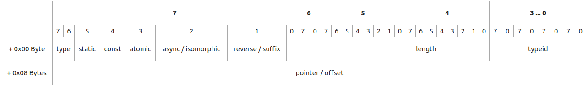

# 0. 总览

`Alioth`是面向对象的静态强类型高级变成语言，旨在降低大规模项目的开发，修改和维护成本。

`Alioth`选择现代高级编程语言中相对合适的语法特性来支持`封装`，`继承`和`多态`这三个面向对象编程的要素。

本文档描述`Alioth`编程语言`1.0`版本的详细设计内容。包括词法规则，语法规则，语义规则，基础概念等。

`Alioth`寄希望于若干语法特性能够高度复合多数编程人员的直觉，以降低学习和开发成本。

充分混合动态类型检查和静态类型检查。

- [0. 总览](#0-%e6%80%bb%e8%a7%88)
- [1. 基础概念](#1-%e5%9f%ba%e7%a1%80%e6%a6%82%e5%bf%b5)
  - [1.1. 模块](#11-%e6%a8%a1%e5%9d%97)
  - [1.2. 片段](#12-%e7%89%87%e6%ae%b5)
  - [1.3. 包](#13-%e5%8c%85)
    - [1.3.1. 包定位器](#131-%e5%8c%85%e5%ae%9a%e4%bd%8d%e5%99%a8)
    - [1.3.2. 包配置文件](#132-%e5%8c%85%e9%85%8d%e7%bd%ae%e6%96%87%e4%bb%b6)
  - [1.4. 域](#14-%e5%9f%9f)
    - [1.4.1. 主域](#141-%e4%b8%bb%e5%9f%9f)
    - [1.4.2. 标准子域](#142-%e6%a0%87%e5%87%86%e5%ad%90%e5%9f%9f)
- [2. 语法设计](#2-%e8%af%ad%e6%b3%95%e8%ae%be%e8%ae%a1)
  - [2.1. 片段](#21-%e7%89%87%e6%ae%b5)
  - [2.2. 模块签名](#22-%e6%a8%a1%e5%9d%97%e7%ad%be%e5%90%8d)
  - [2.3. 依赖描述符](#23-%e4%be%9d%e8%b5%96%e6%8f%8f%e8%bf%b0%e7%ac%a6)
  - [2.4. 定义](#24-%e5%ae%9a%e4%b9%89)
  - [2.5. 类型定义](#25-%e7%b1%bb%e5%9e%8b%e5%ae%9a%e4%b9%89)
  - [2.6. 类定义](#26-%e7%b1%bb%e5%ae%9a%e4%b9%89)
  - [2.7. 成员声明](#27-%e6%88%90%e5%91%98%e5%a3%b0%e6%98%8e)
  - [2.8. 属性声明](#28-%e5%b1%9e%e6%80%a7%e5%a3%b0%e6%98%8e)
  - [2.9. 方法声明](#29-%e6%96%b9%e6%b3%95%e5%a3%b0%e6%98%8e)
  - [2.10 运算符声明](#210-%e8%bf%90%e7%ae%97%e7%ac%a6%e5%a3%b0%e6%98%8e)
  - [2.11. 枚举定义](#211-%e6%9e%9a%e4%b8%be%e5%ae%9a%e4%b9%89)
  - [2.12. 接口定义](#212-%e6%8e%a5%e5%8f%a3%e5%ae%9a%e4%b9%89)
  - [2.13. 实现](#213-%e5%ae%9e%e7%8e%b0)
  - [2.14. 方法实现](#214-%e6%96%b9%e6%b3%95%e5%ae%9e%e7%8e%b0)
  - [2.15. 运算符实现](#215-%e8%bf%90%e7%ae%97%e7%ac%a6%e5%ae%9e%e7%8e%b0)
  - [2.16. 块语句](#216-%e5%9d%97%e8%af%ad%e5%8f%a5)
  - [2.17. 内部语句](#217-%e5%86%85%e9%83%a8%e8%af%ad%e5%8f%a5)
  - [2.18. 变量语句](#218-%e5%8f%98%e9%87%8f%e8%af%ad%e5%8f%a5)
  - [2.19. 分支语句](#219-%e5%88%86%e6%94%af%e8%af%ad%e5%8f%a5)
  - [2.20. 循环语句](#220-%e5%be%aa%e7%8e%af%e8%af%ad%e5%8f%a5)
  - [2.21. for循环语句](#221-for%e5%be%aa%e7%8e%af%e8%af%ad%e5%8f%a5)
  - [2.22. while循环语句](#222-while%e5%be%aa%e7%8e%af%e8%af%ad%e5%8f%a5)
  - [2.23. do-while循环语句](#223-do-while%e5%be%aa%e7%8e%af%e8%af%ad%e5%8f%a5)
  - [2.24. 流控制语句](#224-%e6%b5%81%e6%8e%a7%e5%88%b6%e8%af%ad%e5%8f%a5)
  - [2.24. 表达式](#224-%e8%a1%a8%e8%be%be%e5%bc%8f)
  - [类型假设语句](#%e7%b1%bb%e5%9e%8b%e5%81%87%e8%ae%be%e8%af%ad%e5%8f%a5)
- [关键字列表](#%e5%85%b3%e9%94%ae%e5%ad%97%e5%88%97%e8%a1%a8)
- [运算符设计](#%e8%bf%90%e7%ae%97%e7%ac%a6%e8%ae%be%e8%ae%a1)
  - [成员运算符](#%e6%88%90%e5%91%98%e8%bf%90%e7%ae%97%e7%ac%a6)
    - [元成员](#%e5%85%83%e6%88%90%e5%91%98)
  - [元运算符](#%e5%85%83%e8%bf%90%e7%ae%97%e7%ac%a6)
- [类型系统设计](#%e7%b1%bb%e5%9e%8b%e7%b3%bb%e7%bb%9f%e8%ae%be%e8%ae%a1)
  - [变量类型](#%e5%8f%98%e9%87%8f%e7%b1%bb%e5%9e%8b)
    - [立即数](#%e7%ab%8b%e5%8d%b3%e6%95%b0)
    - [实例](#%e5%ae%9e%e4%be%8b)
    - [引用](#%e5%bc%95%e7%94%a8)
    - [右值引用](#%e5%8f%b3%e5%80%bc%e5%bc%95%e7%94%a8)
    - [数组](#%e6%95%b0%e7%bb%84)
  - [数据类型](#%e6%95%b0%e6%8d%ae%e7%b1%bb%e5%9e%8b)
    - [简单数据类型](#%e7%ae%80%e5%8d%95%e6%95%b0%e6%8d%ae%e7%b1%bb%e5%9e%8b)
      - [基础数据类型](#%e5%9f%ba%e7%a1%80%e6%95%b0%e6%8d%ae%e7%b1%bb%e5%9e%8b)
      - [指针数据类型](#%e6%8c%87%e9%92%88%e6%95%b0%e6%8d%ae%e7%b1%bb%e5%9e%8b)
    - [复合数据类型](#%e5%a4%8d%e5%90%88%e6%95%b0%e6%8d%ae%e7%b1%bb%e5%9e%8b)
      - [具名结构数据类型](#%e5%85%b7%e5%90%8d%e7%bb%93%e6%9e%84%e6%95%b0%e6%8d%ae%e7%b1%bb%e5%9e%8b)
      - [匿名结构数据类型](#%e5%8c%bf%e5%90%8d%e7%bb%93%e6%9e%84%e6%95%b0%e6%8d%ae%e7%b1%bb%e5%9e%8b)
      - [类型描述符](#%e7%b1%bb%e5%9e%8b%e6%8f%8f%e8%bf%b0%e7%ac%a6)
      - [接口数据类型](#%e6%8e%a5%e5%8f%a3%e6%95%b0%e6%8d%ae%e7%b1%bb%e5%9e%8b)
      - [函数类型](#%e5%87%bd%e6%95%b0%e7%b1%bb%e5%9e%8b)

# 1. 基础概念

## 1.1. 模块

`Alioth`编程语言以**模块**$_{(module)}$为单位组织源代码。编译时，每个模块对应产生一个**目标文件**$_{(target\ file)}$。

## 1.2. 片段

每份`Alioth`源代码文件对应一个**片段**$_{(fragment)}$，一个或多个片段构成模块。

## 1.3. 包

`Alioth`以**包**$_{(package)}$为单位发布，安装和检索编译资源。

### 1.3.1. 包定位器

**包定位器**$_{(package\ locator)}$是一种格式化的字符串，用于唯一确定一个包。

格式：`publisher.packageName-arch-platform:major.minor.patch sections`

源码中的**包定位器**通常忽略`section`字段，它在安装，删除包时用于限定操作范围。

定位器中各字段的意义如下：

- **publisher** : 指定包的发布者
- **packageName** : 指定包名称
- **arch** : 指定包可以运行的硬件架构，如下架构是标准名称
  - `x86`
  - `x86_64`
- **platform** : 指定包可以运行的软件平台，如下平台是标准名称
  - `windows`
  - `linux`
- **major** : 主版本号，重大升级，向下不兼容时应当升级主版本号
- **minor** : 副版本号，添加新特性，新功能，向下兼容的升级
- **patch** : 补丁号，修改bug，提升性能等
- **sections** : 指定安装或删除的包段落  
  段落使得一个包内的若干文件可以被分组管理。

### 1.3.2. 包配置文件

在工作域中编辑`doc/packages.json`可以指定打包规则，可以从一个工作域打包若干各程序包。

被安装在仓库域的程序包携带着`doc/alioth-package.json`用于描述已安装的包的相关信息。

## 1.4. 域

`Alioth`将能够部署编译资源的数据源抽象成为**域**$_{(domain)}$，域的实质是一个可达的`uri`或`path`。

### 1.4.1. 主域

`Alioth`定义了若干具有特殊意义的**主域**$_{(primary\ domain)}$

- **根域**$_{(root\ domain)}$  
  默认值 : `./`  
  根域部署着一个名为`alioth`的包。除此之外，还包含着`Alioth`编译器正常运行所需的各种配置文件。
- **工作域**$_{(work\ domain)}$  
  默认值 : `/usr/lib/alioth/`或`C:\alioth\`  
  工作域是编译器执行当前任务的工作环境，工作域的配置文件可以覆盖根域的配置文件。
- **仓库域**$_{(repo\ domain)}$  
  默认值：`/usr/lib/alioth/repo`或`C:\alioth\repo\`  
  仓库域是`Alioth`安装和管理应用包的场所。
- **应用域**$_{(app\ domain)}$  
  默认值 : `alioth://repo/{publisher}/{package}/{version}`  
  每一个安装的包都是一个应用域。

### 1.4.2. 标准子域

`Alioth`定义了若干**标准子域**$_{(standard\ sub\ domain)}$，`Alioth`对资源的管理永远遵循标准子域的定义。

- `arc` : 存放静态链接库
- `bin` : 存放可执行程序
- `data` : 存放用户数据文件
- `doc` : 存放文档与配置文件
- `inc` : 存放模块定义源码
- `lib` : 存放动态链接库
- `obj` : 存放中间编译产物
- `src` : 存放模块实现源码
- `test` : 存放测试单元

# 2. 语法设计

本文档使用[EBNF](https://www.iso.org/standard/26153.html)定义`Alioth`编程语言的语法。在语法规则中，所有的关键字之间都缺省了可能必要的空白符，以使得文法清晰干净，提高可读性。

`Alioth 1.0`编程语言的语法设计目标是追求源码的**可读性和可写性**$_{《Concepts\ in\ Programming\ Languages》_{ISBN-13\ :\ 978-0521780988}}$

## 2.1. 片段

~~~ebnf
fragment = module signature, {definition|implementation};
~~~

## 2.2. 模块签名

~~~ebnf
module signature = "module", label, [":", {dependency descriptor}],  [";"];
~~~

## 2.3. 依赖描述符

~~~ebnf
dependency descriptor = label, ["@" (label|string expression)], ["as", label];
~~~

## 2.4. 定义

~~~ebnf
definition = type definition | class definition | enum definition | interface definition;
~~~

## 2.5. 类型定义

~~~ebnf
type definition = "class", label, "=", type expression;
~~~

## 2.6. 类定义

~~~ebnf
class definition = "class", label, [template parameter list], [super class list], {predicate}, class definition body;

template parameter list = "<", label, {[","], label}, ["...", label], ">";

super class list = ":", type expression, {type expression};

class definition body = "{", {enum definition|member declaration|declaration branch}, "}";

declaration branch = integer, {",", integer}, (":", member declaration|"{", {member declaration}, "}");

predicate = "[", predicate item, {"and", predicate item}, "]";

predicate item = label, ("=="|"!="|"&"|"!&"), (integer|type expression);
~~~

## 2.7. 成员声明

~~~ebnf
member declaration = attribute declaration | method declaration | operator declaration;
~~~

## 2.8. 属性声明

~~~ebnf
attribute declaration = {attribute modifier}, ["&"], label, [":", type expression], ["=", expression];

visibility modifier = "public"|"protected"|"private";

storage modifier = "static";

variable modifier = "const";

attribute modifier = visibility modifier | storage modifier | variable modifier;
~~~

## 2.9. 方法声明

~~~ebnf
method declaration = {method modifier}, label, [string], parameter declaration list, [":", ["&"], type expression];

method modifier = visibility modifier | storage modifier | "async" | "atomic";

parameter declaration list = "(", [parameter declaration, {",", parameter declaration}], ["...", label], ")";

parameter declaration = ["const"], ["&"|"^"], label, [":", type expression], ["=", expression];
~~~

## 2.10 运算符声明

~~~ebnf
operator declaration = "operator", {operator modifier}, operator name, parameter declaration list, [":", type expression];

operator modifier = "const"|"suffix"|"prefix"|"isomorphic"|"reverse";

operator name = 
  "add"|"sub"|"mul"|"div"|"mol"|
  "shl"|"shr"|"bitand"|"bitor"|"bitxor"|"bitrev"|
  "lt"|"gt"|"le"|"ge"|"eq"|"ne"|
  "and"|"or"|"not"|
  "negative"|"increase"|"decrease"|
  "reference"|"assign"|
  "addas"|"subas"|"mulas"|"divas"|"molas"|
  "shlas"|"shras"|"bitandas"|"bitoras"|"bitxoras"|
  "set", (label|integer)|
  "get", (label|integer)|
  "sctor"|"lctor"|"mctor"|"cctor"|
  "move"|
  "call"|
  "index";
~~~

## 2.11. 枚举定义

~~~ebnf
enum definition = "enum", label, "{", {label} , "}";
~~~

## 2.12. 接口定义

~~~ebnf
interface definition = "interface", label, [super interface list], interface definition body;

super interface list = ":", {type expression};

interface definition body = "{", interface declaration, "}";

interface declaration = interface attribute declaration | interface method declaration | operator declaration;

interface attribute declaration = ["const"], ["&"], (label|string), ":", type expression;

interface method declaration = {"const"|"async"}, (label|string), parameter declaration list, [":", ["&"], type expression];
~~~

## 2.13. 实现

~~~ebnf
implementation = method implementation | operator implementation;
~~~

## 2.14. 方法实现

~~~ebnf
method implementation = label, ["(", integer, {integer}, ")"], ".", label, parameter definition list, [":", ["&"], type expression], block statement;

parameter definition list = "(", [parameter definition, {",", parameter definition}], ["...", label], ")";

parameter definition = ["const"], ["&"|"^"], label, ":", type expression;
~~~

## 2.15. 运算符实现

~~~ebnf
operator implementation = "operator", label, ["(", integer, {integer}, ")"], ".", operator name, parameter definition list, [":", [&"], type expression], block statement;
~~~

## 2.16. 块语句

~~~ebnf
statement = block statement | inner statement;
block statement = "{", {inner statement}, "}";
~~~

## 2.17. 内部语句

~~~ebnf
inner statement = variable statement | branch statement | loop statement | flow control statement | expression | assume statement;
~~~

## 2.18. 变量语句

~~~ebnf
variable statement = "var", ["&"], label, {"[",expression, "]"}, [":", type expression], ["=", expression];
~~~

## 2.19. 分支语句

~~~ebnf
branch statement = "if", "(", expression, ")", statement, ["else", statement];
~~~

## 2.20. 循环语句

~~~ebnf
loop statement = for statement | while statement | do while statement;
~~~

## 2.21. for循环语句

~~~ebnf
for statement = "for", ["@", label], "(",( label, {",", label}, ":", expression | ["&"], label, [":", type expression], ["=", expression], ";", expression, ";" expression) ")", statement;
~~~

## 2.22. while循环语句

~~~ebnf
while statement = "while", ["@", label], ["(", expression, ")"], statement;
~~~

## 2.23. do-while循环语句

~~~ebnf
do while statement = "do", ["@", label], statement, "while", "(", expression, ")";
~~~

## 2.24. 流控制语句

~~~ebnf
flow control statement = "return", expression | "continue", ["@", label] | "break", ["@", label];
~~~

## 2.24. 表达式

~~~ebnf
expression = value expression|name expression|member expression|meta expression|await expression|unit expression|comma expression|colon expression|unfold expression|prefix expression|suffix expression|binary expression|index expression|template expression|new expression|delete expression|struct expression|array expression|lambda expression|type expression;

value expression = value;

name expression = name;

member expression = expression, ".", (label|integer);
meta expression = expression, ".!", label;

await expression = ["await"], expression, "(",  comma expression, ")";

unit expression = "(", expression, ")";

comma expression = expression, [",", expression];

colon expression = expression, ":", expression;

unfold expression = "...", expression;

prefix expression = ("*"|"&"|"not"|"~"|"++"|"--"), expression;

suffix expression = expression, ("++"|"--");

binary expression = expression, binary operator, expression;

index expression = expression, "[", expression, "]";

template expression = type expression, "<", comma expression ,">";

new expression = "new", ["(", expression, ")"], ["[", integer, "]"], type expression, [expression];

delete expression = "delete", ["(", expression, ")"], ["[", "]"], expression;

struct expression = "{", comma expression, "}";

array expression = "[", comma expression, "]";

lambda expression = "(" comma expression ")", [":", type expression], block statement;

type expression = "(", comma expression, ")", ":", type expression;

type expression = basic types;

type expression = ("*"|"!"), type expression;

type expression = name expression | member expression | meta expression;

binary operator = 
  "+"|"-"|"*"|"/"|"%"|
  "<<"|">>"|"&"|"|"|"^"|
  "+="|"-="|"*="|"/="|"%="|
  "<<="|">>="|"&="|"|="|"^="|
  "<"|">"|"<="|">="|"=="|"!="|
  "and"|"or";
~~~

## 类型假设语句

~~~ebnf
assume statement = "assume", as expression, statement, ["else", statement];
~~~

# 关键字列表

`and`,
`any`,
`as`,
`assume`,
`async`,
`atomic`,
`await`,
`break`,
`class`,
`const`,
`continue`,
`delete`,
`else`,
`enum`,
`for`,
`if`,
`interface`,
`module`,
`new`,
`not`,
`or`,
`operator`,
`public`,
`protected`,
`private`,
`return`
`static`,
`this`,
`var`,
`while`,

# 运算符设计

## 成员运算符

成员运算符 `.` 用于表示任何拥有成员关系的二者。

包括对象与属性，对象与方法，类与静态属性等。

### 元成员

一些特别的元成员，可以用于表达特殊的语义

- `.class` : 表示一个对象的类型，可以用于定义新的变量

## 元运算符

元运算符`.!`用于获取元信息，多数的元信息仅在编译期有效。

- `.!size` : 获取对象所占据的空间
- `.!offset` : 获取一个成员的偏移量
- `.!symbol` : 函数或类的链接符号
- `.!typeid` : 获取变量或类的`typeid`

# 类型系统设计

在`Alioth`中，类型主要指变量类型和数据类型。差别在于，变量类型在数据持久化时没有实际意义，而数据类型则会影响到数据持久化的结果。

## 变量类型

变量是一个灵活的抽象概念，必要时可以与数据通用。变量的类型规定了变量的基础语义。

### 立即数

立即数变量$_{(immediate)}$是匿名变量，表达式，函数返回值等都属于立即数变量。一个立即数变量的地址是不可靠的，因为它不一定被存储在内存中，可能在寄存器中。

### 实例

实例变量$_{(instance)}$使用栈空间存储对象，执行流离开实例变量所在的作用域时，对象被析构。

~~~
var a : int32 = 3
~~~

### 引用

引用变量$_{(reference)}$使用堆空间存储对象，使用唯一的代理结构$_{(agent\ structure)}$管理对象引用。

执行流离开引用变量所在的作用域时，减少代理结构的引用计数。

使用`new`关键字创建对象时会获得对象的引用。

~~~
var &r : int32 = new A
~~~

引用的数据结构如下:

|字段|偏移量|尺寸|备注|
|---|---|---|---|
|`typeid`|`0 B`|`4 B`|对象的`typeid`|
|`offset`|`4 B`|`4 B`|对象在宿主中的偏移量|
|`pointer`|`8 B`|`8 B`|宿主的代理指针|

当引用指向接口数据类型时，`typeid`字段将被用于检索`接口适配器`$_{interface\ adaptor}$，而对象的实际typeid在接口适配器中能够找到。

代理的数据结构如下:

|字段|偏移量|尺寸|备注|
|---|---|---|---|
|`typeid`|`0 B`|`4 B`|对象的`typeid`|
|`attr`|`4 B`|`4 B`|属性信息 `31 bit` : 对象是否在栈中 `30-0 bit` : 指向此对象的引用计数|
|`pointer`|`8 B`|`8 B`|指向对象的指针|

代理指向的对象一定是一个没有宿主的对象，存在于栈中或静态数据区或堆中。

### 右值引用

右值引用$_{(rvalue\ reference)}$仅能作为参数变量类型存在，一般用于携带深拷贝语义。

用于为右值引用传参的变量将会从符号表除名，它所在的作用域后续将无法使用此变量。

由于右值引用的语义涉及构造和析构，所以右值引用也不能指向接口。

~~~
absorb( ^data : Data ) : void
~~~

### 数组

数组变量$_{(array)}$是连续存储变量的变量。数组变量是一种复合变量。

数组变量不能用于声明参数，不能用于作为返回类型。使用数组传参时会传入对应数据类型的一维指针类型。

## 数据类型

Alioth使用一个`4`字节长的`typeid`来描述一个数据类型。4字节的长度可以适配32为机器的自然字长，也可以和其他属性信息拼接成为8字节的64位自然字长，故这个长度不随架构变化。

> typeid = module_base + offset 这样的设计可以使得动态导入的模块中的typeid同样有效，为以后可能需要的反射机制做准备。

在全局范围内，一个`typeid`即可唯一确定一个类型。为了做到这一点，`Alioth`一定程度上给编码做出了限制。

- 一个Alioth程序最多可以包含$2^{16}$种不同的结构类型。
- 一个Alioth程序最多可以包含$2^{16}$种不同的函数类型。
- 一个Alioth程序最多可以包含$2^{28}$种不同的接口适配。
- 只有简单数据类型可以声明数组变量。
- 类中的每个数组元素总量不能超过`4k`。
- Alioth对象的最大尺寸为`4G`字节。
- Alioth对象最多可以拥有`2G-1`个成员。
- Alioth最高支持8级指针。

### 简单数据类型

简单数据类型是指不可继续拆分的数据类型，包括基础数据类型和指针数据类型。

#### 基础数据类型

`typeid`中的`id`字段表示下列语义

- `0x00`: `void`
- `0x01`: `int8`
- `0x02`: `uint8`
- `0x03`: `int16`
- `0x04`: `uint16`
- `0x05`: `int32`
- `0x06`: `uint32`
- `0x07`: `int64`
- `0x08`: `uint64`
- `0x09`: `bool`
- `0x0a`: `float32`
- `0x0b`: `float64`

#### 指针数据类型

指针数据类型用于保留对基于地址的对象访问的语法支持。在`Alioth`中，指针并不安全，并且不支持动态类型识别。若需要进行动态类型识别，请使用引用。

但是引用机制的空间开销并不小，这是自由的动态类型识别的代价，所以推荐在需要动态类型识别或数据量很大时，可以考虑使用引用机制。

另外，指针不能指向接口类型，因为接口是不能被实例化的一种定义。

### 复合数据类型

复合数据类型需要额外的数据结构来描述其内部的数据类型。

#### 具名结构数据类型

所有的类定义都有对应的具名数据类型。`Alioth`使用**类型描述符**为结构数据类型描述反射信息。

#### 匿名结构数据类型

所有的字面对象都使用匿名结构数据类型，匿名结构数据类型是全局唯一的。只要内容成分相同，两个字面对象的结构数据类型就是相同的。成员的顺序不影响匿名数据结构的定义，因为字面对象的成员会被按照规则重新排列。

#### 类型描述符

`Alioth`在静态数据区分别为具名结构数据类型和匿名结构数据类型维护了两组类型描述符用于描述结构类型的元信息。

|字段|偏移量|尺寸|备注|
|---|---|---|---|
|`call`|`0 B`|`4 B`|调用运算符成员描述符偏移量`offset/8`|
|`base`|`4 B`|`4 B`|基类的`typeid`|
|`member`|`8 B`|`n*16 B`|成员描述符|

- 重载了调用运算符的类被视为仿函数类。  
  需要注意，仿函数对象是不会将宿主对象视为`this`的，因为它的调用运算符传入自己作为`this`对象。仿函数对象的宿主对象可以通过闭包来代入。

成员描述符结构如下。

|字段|偏移量|尺寸|备注|
|---|---|---|---|
|`typeid`|`0 b`|`32 b`|成员的`typeid`|
|`length`|`32 b`|`12 b`|标注数组的元素个数|
|`reverse` `suffix`|`58 b`|`1 b`|标注运算符是否反向重载 或标注运算符是否前缀|
|`async` `isomorphic`|`59 b`|`1 b`|标注方法是否异步 标注运算符是否正反同构|
|`atomic`|`60 b`|`1 b`|标注方法是否为原子操作|
|`const`|`61 b`|`1 b`|标注成员变量是否不可修改 标注成员函数是否拥有可写权限|
|`static`|`61 b`|`1 b`|标注成员是否为静态成员|
|`type`|`62 b`|`2 b`|`00` : 实例变量 `01` : 引用变量 `10` : 方法 `11` : 运算符|
|`pointer` `offset`|`64 b`|`64 b`|成员的指针 成员的偏移量|

在类型描述符中，运算符重载被视为对象方法来看待。

在类型描述符中，成员数组会被降维到一维数组。

#### 接口数据类型

`Alioth`中的接口设计集中了`Alioth`中所有的高于类的抽象，以及所有的动态类型检查。

接口数据类型只能被用于声明引用，而接口引用与对象的匹配原则是基于成分的。

也就是说，接口的定义成分，在对象中都有对应存在，这个接口引用就能被用于指向这个对象。这一系列检查是在编译期间静态检查的。

接口内的方法全是抽象方法，这意味着通过接口引用调用成员的方法，就像在`C++`中调用虚函数一样。

接口引用可以被用于参数，传参时编译器会选择恰当的接口适配器传入参数。

不同名甚至不同作用域下的接口，只要内容相同，就能通用。

接口适配器描述了类与接口之间的成员映射关系，结构如下：

|字段|偏移量|尺寸|备注|
|---|---|---|---|
|typeid|`0 B`|`4 B`|描述对象类型的类型id|
|mapper|`4 B`|`n*4 B`|`31-1` : 描述符偏移量`offset/8` `0` : [未启用]成员是否被实现|

> 未来可能支持接口内定义可选的成员，因此预留了一个成员是否被实现的标志位，同时恰好将实际偏移量限制在16字节对齐。

其中有些自动模糊的设计，接口中的属性，可以对应类的属性，也可以对应类的`get|set`运算符；接口中的方法，可以对应类的方法，也可以对应类的仿函数属性。

接口的成员可以可选的，可选的成员在类的实现中可不存在。

可选成员不能直接使用，需要如下两种后缀运算符：

- `ref.attr?`: 若可选成员不存在，则放弃一条语句。
- `ref.attr!`: 若可选成员不存在，则抛出异常。

#### 函数类型

函数类型的底层实现就是函数的入口指针。函数类型可以被用于构造仿函数，比如`lambda`表达式或者`bundle`对象。

`lambda`表达式是在函数中产生函数的方法，它会将使用到的变量闭包到一个`Context`中以专门管理生命周期。

`bundle`是将一个方法连同它的宿主对象打包，使用时仅传入额外的参数即可调用此对象的方法。

`lambda`和`bundle`的构造方法和实现原理不同，但是它们的行为相同，这是一个重要的抽象。

实际上`lambda`和`bundle`都使用`functor`模板类来实现。

注：重载了调用运算符的类被视为仿函数类，仿函数对象可以被当做静态函数来调用。而实际上仿函数的调用过程传入了以仿函数对象自身为`this`的引用。`lambda`和`bundle`都是匿名的仿函数。