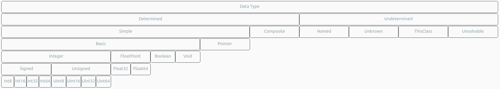

# 3. Chapter three: Class & transparent class

The Alioth programming language is completely object oriented. The concept of `class` is the basical concept of this programming language.

- [3. Chapter three: Class & transparent class](#3-chapter-three-class--transparent-class)
  - [3.1. Module and Transparent class](#31-module-and-transparent-class)
    - [3.1.1. Methods in transparent class](#311-methods-in-transparent-class)
    - [3.1.2 Operator in transparent class](#312-operator-in-transparent-class)
  - [3.2. class](#32-class)
    - [3.2.1. Inheriting other classes](#321-inheriting-other-classes)
    - [3.2.2. Name expression](#322-name-expression)
    - [3.2.3. Type expression](#323-type-expression)
    - [3.2.4. Template class](#324-template-class)
    - [3.2.5. Template class predicate](#325-template-class-predicate)
    - [3.2.6. Definition branch](#326-definition-branch)
  - [3.3. Abstract class](#33-abstract-class)

## 3.1. Module and Transparent class

When coding, the `module` is the biggest abstract unit. To explicitly describe the structure of the module, use the `transparent class`.

The `transparent class` is the global class definition syntax structure who's name is as same as the module's.

~~~ebnf
transparent class signature = "class", #module-name
~~~

Example:

~~~
module hello entry HelloWorld :
  io @ stdlib as this module

class hello {
    method HelloWorld( argc int32, argv **int8 ) int32
}
~~~

As a `syntax sugar`, it's not necessary to write all definitions into the transparent class, syntax structures of type `enum` and `class` can be written just in the `top level scope`.

### 3.1.1. Methods in transparent class

Any methods defined in the `transparent class` will be scanned to become `meta method`.

Compiler search for entry point within these method definitions. Once the compiler find a method has the same name as the specified entry point has, and a correct parameter list was defined, that method will become the first method executed when the program runs.

### 3.1.2 Operator in transparent class

There is no operator definition acceptable in the transparent class, because the transparent class represents the module, and the module is the special-single-instance who cannot be instanced explicitly.

## 3.2. class

It's a huge topic to talk about how the class definition can be written, first of all, let's see how the most simple class definition is designed.

~~~ebnf
class definition = "class", [& "public"|"private"|"abstract" ], class name, '{', definition*, '}';
class name = label;
definition = class definition|enum definition|attribute definition|method definition|operator definition|definition branch;
~~~

The optional modifiers `public`, `private` and `abstract` are `promise`s which means these tokens can be used as label in other context, they take special meanning only when they are written after the keyword `class` when defining classes.

The concept `class` is an abstract level of composite data type and operations on it. The `attribute definition`s make up the memory layout of the composite data type. Operators and methods are operations can be done on those data objects of this data type. Class definitions and enumeration definitions in one class definition makes that class definition a `name scope`.

Example:

~~~
class abstract EmptyAbstractClass {

}
~~~

### 3.2.1. Inheriting other classes

You can specify super classes for one class to make it inherit features from them. Insert a `superclass list` using colon to do that.

~~~ebnf
class definition = "class", [& "public"|"private"|"abstract" ], class name, ":", superclass list, '{', definition*, '}';
superclass lsit = name expression+;
~~~

The entity `name expression` shown above will be talked about soon enough, for now, we just need to know that one `class name` can be used as a `name expression`.

Example:

~~~
class EmptySubClass : EmptyAbstractClass {

}
~~~

By inheriting one superclass, the `memory layout` and `interface` will be inherited, but sub definitions will not.

It's difficult to avoid member name symbol conflict when inheriting multiple superclasses. The name expression can be used to solve this problem.

### 3.2.2. Name expression

The `name expression` is used to refer to  definitions and implementations across scopes.

The formal format as follow:

~~~ebnf
name expression = label [template argument list] [ ("::"|'@'), name expression ];
template argument list = '<', type expression++',', '>';
~~~

The name expression can be separated into sections by the `scope operator` "::". The left most section will be searched for firstly.

Once a section was found, it'll be searched as a scope to look for the next section.

If more than one instance can be found for one corresponding name, the operator `@` is used to tell the compiler which scope the instance you want belongs to. You can use this operator only when you are searching superclasses.

The entity `template argument list` above is involved with the concept of `template class`, which is a topic coming soon. First of all we have to understand what is the concept of `type expression` talking about.

### 3.2.3. Type expression

According to the `type system` provided by the Alioth programming language, There are two major kinds of `data types`, the map of the data types as follow.
<!-- 

Data Type

Determined

Undetermined

Simple

Composite

Named

Unknown

ThisClass

Unsolvable

Basic

Pointer

Integer

FloatPoint

Boolean

Void

Signed

Unsigned

Float32

Float64

Int8

Int16

Int32

Int64

Uint8

Uint16

Uint32

Uint64
 -->

The `type expression` is used to express `data type`, formal format as follow:

~~~ebnf
type expression = basic data type ;
type expression = name expression ;
type expression = '*'|'^', type expression ;
type expression = "this class" | type expression ;
type expression = [ type expression ];

basic data type = "void"|"bool"|"float32"|"float64"|"int8"|"int16"|"int32"|"int64"|"uint8"|"uint16"|"uint32"|"uint64";
~~~

The first line tells us that we can express basic data type; There are 12 kinds of basic data types ready for use.

The second line tells us that we can express user-defined data type by `name expression`; By using `name expression`, we can refer to a class or an renamed data type.

The third line tells us that we can add pointer constraints to data type to make up pointer type. The modifier `*` assigns pointer feature without constraint, and the modifier `^` assigns pointer feature with read-only limition.

The fourth line tells us that we can use the combined keyword `this class` to refer to the data type which the class represents.

The fifth line tells us that sometimes, we can skip the type expression. For example when you're defining a quasi method, you can skip the return data type. Or when you're constructing a data object which the compiler can detect its data type using the context.

### 3.2.4. Template class

The concept of `template class` is as same as which concept in the c plus plus programming language. You can specify a `template argument list` for your `template class` when defining it. All available `template argument`s are `element prototype`s. Every use case of the `template class` with different `template argument list` represents different scopes.

The formal format of class definition as follow:

~~~ebnf
class definition = "class", [& "public"|"private"|"abstract" ], class name, [template argument list definition], [superclass list], "{", definition*, "}";
template argument list definition = "<", label++"," ,">";
~~~

Example:

~~~
class public EmptyTemplateClass <K,V> {

}
~~~

We will talk about the concept of `element prototype` when we are going to discuss the `attribute definition`.

### 3.2.5. Template class predicate

You can constraint the range of available template argument for the template class you designed, use the template class predicate to have this done.

The formal format as follow:

~~~ebnf
class definition = "class", [& "public"|"private"|"abstract" ], class name, [template argument list definition], [superclass list], [template class predicate]* "{", definition*, "}";
template class predicate = "[", predicate unit++"and", "]";
predicate unit = label, ("=="|"!="|"<"|<="|">"|">="), (element type | type expression);
element type = "obj"|"ptr"|"ref"|"rel";
~~~

You can specify more than one predicates for template class, the compiler accept the template argument list once one of them turns true.

Every predicate consist one or more predicate units separated with keyword `and`. This predicate turns true only if all predicate units turn true.

As we can see, the predicate unit is a template argument name connected with a target connected using an operator.

The meaning of operators supported as follow :

- `==`:
  - for `element type`: the argument must match that element type specified.
  - for `type expression`: the argument must match that data type.
- `!=`:
  - for `element type`: the argument must not match that element type specified.
  - for `type expression`: the argument must not match that data type specified.
- `<`:
  - for `type expression`: the argument must be the class inherited the class specified.
- `<=`:
  - for `type expression`: the argument must match that class specified or inherit the class specified.
- `>`:
  - for `type expression`: the argument must not inherit the class specified.
- `>=`:
  - for `type expression`: the argument must not inherit the class specified, but it may match the class specified.

### 3.2.6. Definition branch

Compiler will number all predicates automatically beginning with zero. You can decide contents of class definition according to the index of which predicate was turned true.

The formal format as follow:

~~~ebnf
definition branch = predicate index, ":", (definition|"{", definition*, "}");
prediacate index = decimal digit;
~~~

## 3.3. Abstract class

An abstract class or a class inherited an abstract class cannot be instanced until it's all abstract methods are implemented. When called, the abstract class always excute the most deep version of overrided method.