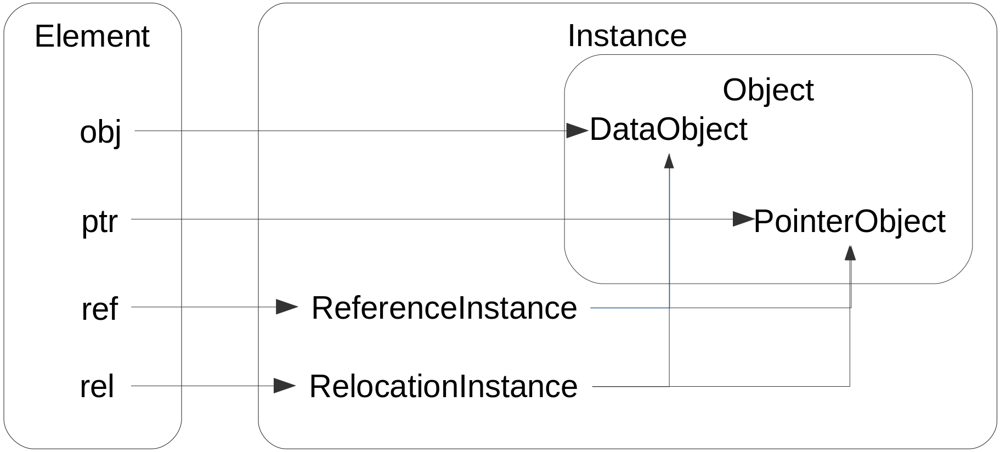

# 4. Chapter four: Attribute & element

Objects are sets of attributes, methods are operations  which could be done on objects. Class definitions are prototypes for objects, so we have to describe what attributes the object can have.

Every attribute for class in the Alioth programming language is an `element`, in this page, let's talk about the concept of `element` and `attribute`.

- [4. Chapter four: Attribute & element](#4-chapter-four-attribute--element)
  - [4.1. Concepts about element](#41-concepts-about-element)
    - [4.1.1. instance](#411-instance)
    - [4.1.2. object](#412-object)
    - [4.1.3. element types](#413-element-types)
    - [4.1.4. element prototype](#414-element-prototype)
  - [4.2. Attribute definition](#42-attribute-definition)
    - [4.2.1. Promises in attribute definition](#421-promises-in-attribute-definition)
    - [4.2.2. Attribute using template argument](#422-attribute-using-template-argument)

## 4.1. Concepts about element

Actually, the concept of `element` comes from the concept `variable` in the C programming language, but the concept of `element type` is different from the concept of `variable type`. So we use a concept named `element` to avoid concept naming conflict.

The `element` is a name bundled with an `instance`, that makes `instance`s addressable when coding.

### 4.1.1. instance

Anything occupies space in memory is called `instance`.

### 4.1.2. object

Any `instance` who can be described in source code and have a data type is called `object`.

### 4.1.3. element types

There are four `element types` designed, each of them has a special duty.

- obj:  
  Elements of `obj` type can be used to bundle `DataObject` only. Objects of `basic` data type or `composite` data type are called `DataObject`.  
  When terminating the life cycle of an `obj` element, the `DataObject` boundled will be destroyed.

- ptr:  
  Elements of `ptr` type can be used to bundle `PointerObject` only. Objects of pointer data type are called `PointerObject`.

- ref:  
  Elements of `ref` type can be used to bundle objects already exist only. If the object bundled was constructed in `stack`, it will be moved into memory zone under control. This automatical action will trigger the `operator move`.

- rel:  
  Elements of `rel` type can be used to catch the control of the life cycle of one object. It's allowed to be used as parameter element type only. The element used to pass the parameter will lose the control of the object it boundled.

### 4.1.4. element prototype

The concept of `element` is the only medium used to access objects in the Alioth programming language. It consists of two parts, `element name` and `element prototype`.

The `element prototype` consists of `element type` and `data type`.

Unlike the C++ programming language, we use `element prototype` more often to exchange type informations rather than `data type`.

There's an attribute of element prototype, which is called `element constraint`. If it's turns true, the element has no right to modify the object it boundled. Append a modifier `const` right after the `element type` to enable the `element constraint`.

## 4.2. Attribute definition

The `attribute` of one `class` is a kind of element, the formal format to define an attribute as follow:

~~~ebnf
attribute definition = element type, attribute modifier*, attribute name, type expression;
element type = "obj"|"ptr"|"ref"|"rel";
attribute modifier = "public"|"private"|"protected"|"const";
attribute name = label;
~~~

Example:

~~~
class Vector3d {
    obj public x float64
    obj public y float64
    obj public z float64
}
~~~

Note, most definition syntax structure has no explicit terminator, this is because all definition syntax structure has special leading keyword.

### 4.2.1. Promises in attribute definition

The modifier `public`, `protected` and `private` are `promise`s, which means that you may make them element name somehow.

~~~
class Note {
    obj $public bool
}
~~~

The prefix `$` makes compiler knows that the token right following is a element name. By this method, you may avoid many conflict between `promise` and `lable`.

Example:

~~~
class $abstract {
    obj $public bool
}
~~~

In another situation, prefixed `promise` which is used, will not be detected again.

~~~
class abstract abstract {
    object private private bool
}
~~~

Formally, when defining, the prefix modifier `$` destroys the possibility of becoming `promise` for the token right following it.

### 4.2.2. Attribute using template argument

If you're using `template argument` as data type of attribute, you may have to decide element type according to the data type of the `template argument`.

You can design predicate for the class and use the definition branch to solve this problem, however, there's another convenient way to go.

Use the placeholder `%` to replace element type keyword, let the compiler to choose the most proper element type.

Example:

~~~
class TemplateClass<T> {
    % private m_data T
}
~~~

Finally, the formal format of attribute definition as follow:

~~~ebnf
attribute definition = (place holder|element type), element modifier*, [element name indicator] element name, type expression;
element name indicator = "$";
place holder = "%";
~~~